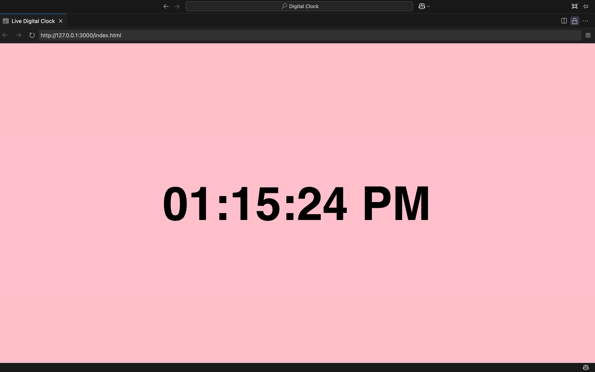

# Digital Clock Web App
This is my **first ever web development project**. Its a simple responsive digital clock built with **HTML**, **CSS**, and **Javascript**. The current time is displayed in 12 hour format with AM/PM and updates every second in real time.\

## Features
-Real time updates every second
-12-hour time format with AM/PM
-Centered layout using CSS Flexbox
-Custom font and background color for a modern look
-Responsive design (works on different screen sizes)

## What I Learned
-Basic HTML structure, tags
-Styling layouts using CSS Flexbox
-DOM manipulation using Javascript
-Display real time content using Date() and setInterval()
-How to construct a beginner level web project

## Technologies Used
-HTML
-CSS
-JavaScript

## Screenshot

## How to View
Open ['index.html'](http://127.0.0.1:3000/index.html) in your browser.
